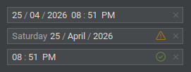

# DateTime Field

### Overview

The `JDateTimeField` component provides a modern and flexible way to input and edit date-time values in Swing
applications.
It supports validation, customizable placeholders, and flexible date-time formatting.



### Project Structure

``` text
.
└── raven/
    └── swingpack/
        ├── datetime/
        │   ├── event/
        │   │   ├── DateTimeSelectionListener.java
        │   │   └── InputChangeListener.java
        │   ├── validation/
        │   │   ├── DateTimeValidator.java
        │   │   └── ValidationResult.java
        │   ├── DateTimeItemRenderer.java
        │   ├── DefaultDateTimeItemRenderer.java
        │   ├── DateTimeModel.java
        │   ├── DateTimePatternParser.java
        │   └── ...
        └── JDateTimeField.java
```

### Example

#### Create the datetime field

``` java
// initial
JDateTimeField dateTimeField = new JDateTimeField();

// initial with datetime
JDateTimeField dateTimeField = new JDateTimeField(LocalDateTime dateTime);

// initial with model
JDateTimeField dateTimeField = new JDateTimeField(model);
```

---

#### Create event datetime selection listener

``` java
dateTimeField.addDateTimeSelectionListener(new DateTimeSelectionListener() {
    @Override
    public void dateTimeSelected(DateTimeSelectionEvent event) {
        System.out.println("Datetime changed: " + dateTimeField.getSelectedDateTime());
    }
});
```

---

#### Create validator

``` java
dateTimeField.setValidator(new DateTimeValidator() {
    @Override
    public ValidationResult validate(LocalDateTime dateTime) {
        ValidationResult result = new ValidationResult();
        if (dateTime != null) {
            if (dateTime.isBefore(LocalDateTime.now().truncatedTo(ChronoUnit.MINUTES))) {
                result.addViolation("The selected datetime is in the past.");
            }
        } else {
            result.addViolation("A datetime selection is required.");
        }
        return result;
    }
});
```

---

#### Custom Value formatter

*Allows overriding how each date-time segment is displayed.*

*For example, with the pattern `dd-MM-yyyy`, the default output is `25-04-2026`.*</br>
*You can display the month as a full name when it is not selected, e.g. `25-April-2026`.*

``` java
dateTimeField.setValueFormatter(context -> {
    DateTimePart part = context.getPart();
    if (!context.isSelected() && part.getType() == DateTimePart.Type.MONTH) {
        int value = part.getValue();
        if (value > 0 && value <= 12) {
            return DateTimePatternParser.getMonthsLong(value);
        }
    }
    return null;
});
```

---

#### Custom Placeholder formatter

*Allows overriding how placeholder text is displayed for each date-time segment.*

*For example, you can replace default placeholders with custom labels like `Day`, `Month`, and `Year`, and use `--` for
time segments.*

``` java
dateTimeField.setPlaceholderFormatter(context -> {
    DateTimePart part = context.getPart();
    if (part.getType() == DateTimePart.Type.MONTH) {
        return "Month";
    } else if (part.getType() == DateTimePart.Type.YEAR) {
        return "Year";
    } else if (part.getType() == DateTimePart.Type.DAY) {
        return "Day";
    } else if (!part.isSeparator()) {
        return "--";
    }
    return null;
});
```

---

#### Commit Mode

Define how the component handles invalid date/time input during editing and when focus is lost.

``` java
public enum CommitMode {
    NULL_ON_INVALID,
    REVERT_ON_INVALID,
    TEMP_ON_INVALID
}
```

| Mode                         | Invalid While Typing                                                | Invalid On Focus Lost                                 |
|------------------------------|---------------------------------------------------------------------|-------------------------------------------------------|
| `NULL_ON_INVALID`            | Value is set to `null`                                              | Field is cleared and placeholder is shown             |
| `REVERT_ON_INVALID`          | Ignored (value does not change)                                     | Field reverts to the last valid value                 |
| `TEMP_ON_INVALID`  (default) | - Displayed as the current input<br/> - Value is set to `null`<br/> | Still displays the current input (value stays `null`) |

##### Notes

- In `TEMP_ON_INVALID`, the displayed text may be invalid while the internal value remains `null`.
- Use `getSelectedDateTime()` to retrieve the parsed value (returns `null` if input is invalid).
- Use `isValidationValid()` to check whether the current input is valid before processing.

##### Example

``` java
if (dateTimeField.isValidationValid()) {
    LocalDateTime dateTime = dateTimeField.getSelectedDateTime();
    // do something ...
}
```

---

### Properties

| Property                 | Default Value                 | Description                                                                                                                                               |
|--------------------------|-------------------------------|-----------------------------------------------------------------------------------------------------------------------------------------------------------|
| `model`                  | `DateTimeModel`               | The data model that manages the date-time value and state.                                                                                                |
| `itemRenderer`           | `DefaultDateTimeItemRenderer` | Custom renderer used to paint each date-time item.                                                                                                        |
| `pattern`                | `"DD/MM/yyyy hh:mm a"`        | Defines the date-time format pattern used for input and display.                                                                                          |
| `commitMode`             | `CommitMode.TEMP_ON_INVALID`  | Controls how invalid or incomplete input is handled:<br/>`CommitMode.NULL_ON_INVALID`<br/>`CommitMode.REVERT_ON_INVALID`<br/>`CommitMode.TEMP_ON_INVALID` |
| `placeholderCaseStyle`   | `CaseStyle.ORIGINAL`          | Determines the case style of placeholder text:<br/> `CaseStyle.ORIGINAL`<br/>`CaseStyle.LOWER`<br/>`CaseStyle.UPPER`                                      |
| `selectionStyle`         | `SelectionStyle.BACKGROUND`   | Determines the selection style:<br/>`SelectionStyle.BACKGROUND`<br/>`SelectionStyle.DASHED`<br/>`SelectionStyle.DASHED_WITH_BACKGROUND`                   |
| `placeholderFormatter`   | `null`                        | Custom formatter for rendering placeholder text.                                                                                                          |
| `valueFormatter`         | `null`                        | Custom formatter for rendering the date-time value.                                                                                                       |
| `validator`              | `null`                        | Validator used to check the validity of the input value.                                                                                                  |
| `showClearButton`        | `false`                       | Determines whether a clear (reset) button is displayed.                                                                                                   |
| `validationPopupEnabled` | `true`                        | Enables a popup to display validation messages.                                                                                                           |
| `spaceWidth`             | `0`                           | Defines the width of the space character (`' '`) between date-time segments. Use `-1` for default spacing, or set a custom width (e.g., 5).               |
| `itemGap`                | `1`                           | Sets the gap (in pixels) between each segment.                                                                                                            |
| `itemArc`                | `5`                           | Defines the arc (corner radius) for segment rendering. Use `-1` to apply the default laf theme arc.                                                       |
| `validationErrorIcon`    | `null`                        | Icon displayed when validation fails. Uses default icon when `null`.                                                                                      |
| `validationWarningIcon`  | `null`                        | Icon displayed for validation warnings. Uses default icon when `null`.                                                                                    |
| `validationSuccessIcon`  | `null`                        | Icon displayed when validation is successful. Uses default icon when `null`.                                                                              |

### Methods

| Method                                                                | Return Value       | Description                                                                |
|-----------------------------------------------------------------------|--------------------|----------------------------------------------------------------------------|
| `getSelectedDateTime()`                                               | `LocalDateTime`    | Returns the currently selected date-time value.                            |
| `getInputDateTime()`                                                  | `LocalDateTime`    | Returns the currently input date-time value.                               |
| `setSelectedDateTime(LocalDateTime dateTime)`                         |                    | Sets the selected date-time value.                                         |
| `setSelectedDate(LocalDate date)`                                     |                    | Sets only the date part of the value.                                      |
| `setSelectedTime(LocalTime time)`                                     |                    | Sets only the time part of the value.                                      |
| `now()`                                                               |                    | Sets the value to the current system date-time.                            |
| `clearSelectedDateTime()`                                             |                    | Clears the selected date-time value.                                       |
| `clearInput()`                                                        |                    | Clears the current input value.                                            |
| `isValidationValid()`                                                 | `boolean`          | Returns `true` if the input is valid and validation severity is not error. |
| `isValidationSuccess()`                                               | `boolean`          | Returns `true` if validation is successful.                                |
| `isValidationError()`                                                 | `boolean`          | Returns `true` if validation has errors.                                   |
| `isValidationWarning()`                                               | `boolean`          | Returns `true` if validation has warnings.                                 |
| `getValidationResult()`                                               | `ValidationResult` | Returns the current validation result.                                     |
| `validationDateTime()`                                                | `ValidationResult` | Performs validation and returns the result.                                |
| `setValidationResult(ValidationResult validationResult)`              |                    | Sets the validation result manually.                                       |
| `clearValidationField()`                                              |                    | Clears validation state and resets the result to `null`.                   |
| `addDateTimeSelectionListener(DateTimeSelectionListener listener)`    |                    | Adds a listener to receive date-time selection events.                     |
| `removeDateTimeSelectionListener(DateTimeSelectionListener listener)` |                    | Removes a previously added date-time selection listener.                   |
