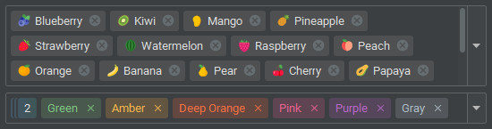

# Multi-Select ComboBox

### Overview

The `JMultiSelectComboBox` is a modern Swing component that allows users to select multiple items in a single combo
box.  
It supports wrapping, scrolling, and right-to-left (RTL) layouts.



### Project Structure

``` ext
.
└── raven/
    └── swingpack/
        ├── multiselect/
        │   ├── event/
        │   │   ├── MultiSelectAdapter.java
        │   │   └── MultiSelectListener.java
        │   ├── icons/
        │   │   ├── AbstractItemActionIcon.java
        │   │   └── ItemActionIcon.java
        │   ├── MultiSelectItemEditable.java
        │   ├── MultiSelectItemRenderer.java
        │   ├── MultiSelectModel.java
        │   └── ...
        ├── util/
        │   └── SwingPackUtils.java
        └── JMultiSelectComboBox.java
```

### Example

#### Create with model

``` java
String[] items = {"Blueberry", "Kiwi", "Mango"};
ComboBoxModel<String> model = new DefaultComboBoxModel<>(items);
JMultiSelectComboBox<String> multiSelect = new JMultiSelectComboBox<>(model);
```

---

#### Create empty and add items manually

``` java
JMultiSelectComboBox<String> multiSelect = new JMultiSelectComboBox<>();

multiSelect.addItem("Blueberry");

// add with selected state
multiSelect.addItem("Kiwi",true);
```

---

#### Item editable

*Control which items can be added or removed by customizing the item edit behavior.*

``` java
multiSelect.setItemEditable(new MultiSelectItemEditable() {
    @Override
    public boolean isItemAddable(Object item) {
        // allow to add Blueberry and Kiwi
        return item.equals("Blueberry") || item.equals("Kiwi");
    }

    @Override
    public boolean isItemRemovable(Object item) {
        // allow to remove all except Blueberry
        return !item.equals("Blueberry");
    }
});
```

---

#### Item container background

*Change the background color using FlatLaf style properties.*

``` java
multiSelect.putClientProperty(FlatClientProperties.STYLE, "" +
        "editableBackground:#DEDEDE;");
```

---

### Properties

| Property                | Default Value                    | Description                                                                                                                                                                    |
|-------------------------|----------------------------------|--------------------------------------------------------------------------------------------------------------------------------------------------------------------------------|
| `itemEditable`          | `null`                           | Controls which items can be added or removed.                                                                                                                                  |
| `itemRenderer`          | `DefaultMultiSelectItemRenderer` | Custom renderer for displaying each selected item.                                                                                                                             |
| `noVisualPadding`       | `false`                          | Control item renderer`s layout to ignore the focus border.                                                                                                                     |
| `showItemRemovableIcon` | `true`                           | Determines whether the remove (x) icon appears on selected items.                                                                                                              |
| `itemRemovableTextGap`  | `3`                              | Gap (in pixels) between the removable icon and the item text.                                                                                                                  |
| `itemGap`               | `5`                              | Horizontal and vertical space between each selected item.                                                                                                                      |
| `itemArc`               | `-1`                             | Arc radius for rounded item corners. A negative value uses the default theme setting.                                                                                          |
| `itemAlignment`         | `SwingConstants.LEADING`         | Alignment of items inside the combo box.                                                                                                                                       |
| `removableIcon`         | `DefaultRemovableIcon`           | The icon used for item removal; can be replaced with a custom `ItemActionIcon` implementation.                                                                                 |
| `itemContainerInsets`   | `Insets(5, 5, 5, 5)`             | Inner padding around the item container.                                                                                                                                       |
| `itemInsets`            | `Insets(3, 7, 3, 7)`             | Padding inside each item (top, left, bottom, right).                                                                                                                           |
| `row`                   | `0`                              | Specifies the number of visible rows in the combo box. When set to `0`, the combo box uses its default height; otherwise, the height adjusts based on the number of item rows. |
| `overflowPopupEnable`   | `true`                           | Enables or disables the overflow popup when items exceed visible space.                                                                                                        |
| `overflowPopupItemRow`  | `3`                              | Specifies the number of visible rows in the overflow popup. When set to `0`, the popup height is determined by the `overflowPopupSize` property.                               |
| `overflowPopupSize`     | `Dimension(250, 100)`            | Sets the preferred size of the overflow popup.                                                                                                                                 |
| `displayMode`           | `DisplayMode.AUTO_WRAP`          | Controls how selected items are displayed. `AUTO_WRAP` wraps items and shows a hidden-count button when overflowed. `WRAP_SCROLL` enables scrolling through items.             |

### Methods

| Method                                              | Return Value | Description                                                                       |
|-----------------------------------------------------|--------------|-----------------------------------------------------------------------------------|
| `getOverflowItemCount()`                            | `int`        | Returns the number of items currently hidden in the overflow area.                |
| `getOverflowItems()`                                | `Object[]`   | Returns an array of items that are currently in the overflow area.                |
| `addItem(E item)`                                   |              | Adds a new item to the combo box.                                                 |
| `addItem(E item, boolean selected)`                 |              | Adds a new item and marks it as selected if `true`.                               |
| `isSelectedItem(Object item)`                       | `boolean`    | Checks whether the specified item is selected.                                    |
| `addSelectedItem(Object item)`                      |              | Marks the specified item as selected.                                             |
| `removeSelectedItem(Object item)`                   |              | Removes the specified item from the selected list.                                |
| `removeSelectedItemAt(int index)`                   |              | Removes the selected item at the given index.                                     |
| `clearSelectedItems()`                              |              | Clears all selected items.                                                        |
| `clearSelectedItemsForce()`                         |              | Clears all selected items, ignoring editable rules.                               |
| `getSelectedItems()`                                | `Object[]`   | Returns an array of currently selected items.                                     |
| `getSelectedItemCount()`                            | `int`        | Returns the number of selected items.                                             |
| `getSelectedItemAt(int index)`                      | `Object`     | Returns the selected item at the given index.                                     |
| `getSelectedItemIndex(Object item)`                 | `int`        | Returns the index of the specified selected item.                                 |
| `showOverflowPopup()`                               |              | Displays the overflow popup near the combo box.                                   |
| `showOverflowPopup(Component com, int x, int y)`    |              | Displays the overflow popup at a custom location relative to the given component. |
| `addEventListener(MultiSelectListener listener)`    |              | Adds a listener to handle selection, removal, and overflow events.                |
| `removeEventListener(MultiSelectListener listener)` |              | Removes a previously added listener.                                              |
