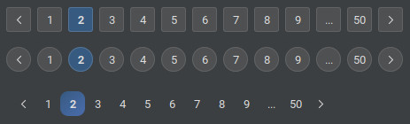

# Pagination

### Overview

The `JPagination` component provides a simple and flexible way to navigate through multiple pages of content in Swing
applications.



### Project Structure

``` text
.
└── raven/
    └── swingpack/
        ├── pagination/
        │   ├── event/
        │   │   └── PaginationModelListener.java
        │   ├── icons/
        │   │   └── PageArrowIcon.java
        │   ├── Page.java
        │   ├── PaginationItemRenderer.java
        │   ├── PaginationModel.java
        │   └── ...
        ├── util/
        │   └── SwingPackUtils.java
        └── JPagination.java
```

### Example

#### Create the pagination

``` java
// initial with default
JPagination pagination = new JPagination();

// initial with maxItem
JPagination pagination = new JPagination(maxItem);

// initial with selectedPage and pageSize
JPagination pagination = new JPagination(selectedPage, pageSize);

// initial with maxItem, selectedPage and pageSize
JPagination pagination = new JPagination(int maxItem, int selectedPage, int pageSize);

// initial with pagination model
JPagination pagination = new JPagination(model);
```

---

#### Create event pagination changed listener

``` java
pagination.addChangeListener(new ChangeListener() {
    @Override
    public void stateChanged(ChangeEvent changeEvent) {
        System.out.println("Page changed: " + pagination.getSelectedPage());
    }
});
```

---

#### Custom item renderer

``` java
pagination.setItemRenderer(new DefaultPaginationItemRenderer() {
    @Override
    public Component getPaginationItemRendererComponent(JPagination pagination, Page page, boolean isSelected, boolean isPressed, boolean hasFocus, int index) {
        super.getPaginationItemRendererComponent(pagination, page, isSelected, isPressed, hasFocus, index);
        FlatLafStyleUtils.appendStyle(this, "" +
                "arc:999;");
        return this;
    }
});
```

---

#### Control item selected value

``` java
pagination.setPageRange(selectedPage, pageSize);

pagination.setPageSize(pageSize);

pagination.hasPrevious();

pagination.hasNext();
```

---

#### Example using model listener

``` java
pagination.getModel().addPaginationModelListener(new PaginationModelListener() {
    @Override
    public void paginationModelChanged(PaginationModelEvent event) {
        if (event.isPageChanged()) {
            System.out.println("old page: " + event.getOldPage());
            System.out.println("new page: " + event.getNewPage());
        }
    }
});
```

---

### Properties

| Property                 | Default Value                   | Description                                                                                   |
|--------------------------|---------------------------------|-----------------------------------------------------------------------------------------------|
| `paginationModel`        | `DefaultPaginationModel`        | The data model that manages pagination state.                                                 |
| `itemRenderer`           | `DefaultPaginationItemRenderer` | Custom renderer used to paint each pagination item.                                           |
| `maxItem`                | `7`                             | The maximum number of page buttons displayed at once.                                         |
| `showNavigationButton`   | `true`                          | Determines whether the navigation buttons (`Next` and `Previous`) are shown.                  |
| `alwaysEnableNavigation` | `false`                         | Keeps the navigation buttons enabled even when there are no next or previous pages available. |
| `hideWhenNoPage`         | `true`                          | Hides the pagination component when there are no pages available.                             |
| `noVisualPadding`        | `false`                         | Control item renderer`s layout to ignore the focus border.                                    |
| `loop`                   | `false`                         | Enables looping navigation — going next from the last page jumps back to the first page.      |
| `itemSize`               | `Dimension(28, 28)`             | Defines the size of each pagination button.                                                   |
| `itemGap`                | `7`                             | Sets the gap (in pixels) between pagination items.                                            |
| `previousIcon`           | `PageArrowIcon()`               | Icon used for the `Previous` navigation button.                                               |
| `nextIcon`               | `PageArrowIcon()`               | Icon used for the `Next` navigation button.                                                   |

### Model Properties

| Property       | Default Value | Description                                                  |
|----------------|---------------|--------------------------------------------------------------|
| `maxItem`      | `7`           | The maximum number of page buttons displayed at once.        |
| `selectedPage` | `0`           | The currently selected (active) page number.                 |
| `pageSize`     | `0`           | The total number of pages available in the pagination model. |

### Methods

| Method                                          | Return Value | Description                                          |
|-------------------------------------------------|--------------|------------------------------------------------------|
| `getSelectedPage()`                             | `int`        | Returns the currently selected page number.          |
| `setSelectedPage(int selectedPage)`             |              | Sets the current page number.                        |
| `getPageSize()`                                 | `int`        | Returns the total number of pages.                   |
| `setPageSize(int pageSize)`                     |              | Sets the total number of pages.                      |
| `setPageRange(int selectedPage, int pageSize)`  |              | Updates both the selected page and total page size.  |
| `hasPrevious()`                                 | `boolean`    | Returns `true` if a previous page is available.      |
| `hasNext()`                                     | `boolean`    | Returns `true` if a next page is available.          |
| `addChangeListener(ChangeListener listener)`    |              | Adds a listener to receive pagination change events. |
| `removeChangeListener(ChangeListener listener)` |              | Removes a previously added change listener.          |
